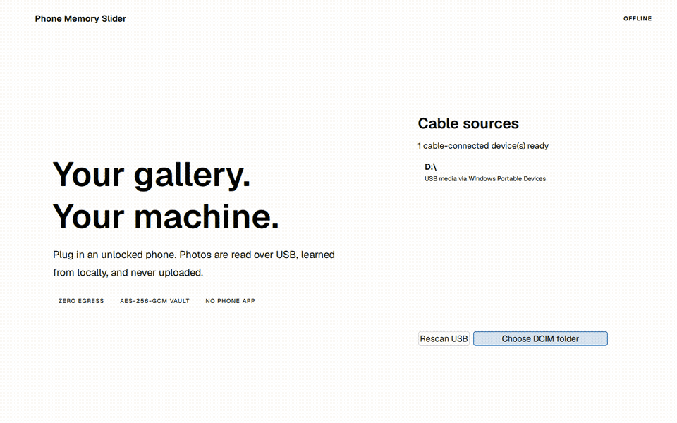
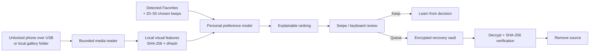

# Phone Memory Slider

<p align="center">
  <strong>Your gallery. Your taste. Your machine.</strong><br>
  Private photo cleanup over a cable, with a personal model and a human final decision.
</p>

<p align="center">
  <a href="https://github.com/Coflazo/phone-memory-slider/actions/workflows/ci.yml"></a>
  
  
  
  <a href="LICENSE"></a>
</p>

<p align="center">
  <a href="brag-output/product-demo.mp4"></a>
</p>

<p align="center">
  <a href="brag-output/product-demo.mp4">Watch the full-resolution demo</a> ·
  <a href="https://www.figma.com/design/hVRuncNTA1D6rBb0zYT3CF">Open the editable Figma file</a> ·
  <a href="docs/USER_GUIDE.md">User guide</a>
</p>

Phone Memory Slider reads cable-accessible photos and videos without a phone app, learns a compact preference profile from detected Favorites and 20–50 photos you deliberately choose as keeps, and orders the rest from “review first” to “probably keep.” Nothing is uploaded, nothing is deleted automatically, and every approved removal receives an authenticated encrypted recovery copy before the source item is removed.

> [!IMPORTANT]
> This is release-candidate source, not a signed consumer installer. The Windows pipeline and simulated end-to-end deletion flow are tested. Real-phone acceptance, code signing, and the full OS/device matrix remain release gates.

## Why it is different

| | Phone Memory Slider |
|---|---|
| Personal signal | Learns visual preferences from detected Favorites, selected keep photos, and later swipe labels |
| Processing | C++ analysis and ML on the computer; no remote model or API |
| Connection | USB-visible media or a mounted/local gallery folder; no phone companion |
| Decision | The model ranks; the person decides every keep or removal |
| Deletion | Copy → AES-256-GCM encrypt → decrypt and SHA-256 verify → remove source |
| Business model | Free, open source, no account, ads, subscription, telemetry, or updater |

## The flow



There is deliberately no network node. Product source contains no HTTP/socket client and the executable has no direct Qt Network import. Qt Quick and Qt Multimedia require Qt's shared network library transitively, so network-information, TLS, and TCP QML-debug plugins are stripped from release packages. [`scripts/check-repository.ps1`](scripts/check-repository.ps1) checks source, while [`scripts/check-package.ps1`](scripts/check-package.ps1) checks the built ZIP.

## What the ML actually does

This is small, deterministic machine learning—not a cloud model wearing an “AI” label.

1. Each decoded preview becomes a 16-dimensional visual vector: mean RGB, luminance and contrast, saturation, edge density, extreme exposure, aspect/orientation, media type, normalized size and duration, face presence, and luminance entropy.
2. With favorites only, a one-class distance model measures how much an item resembles the positive examples. The personal signal activates at 20 favorites. Folders named `Favorites` or `Favourites` are detected automatically when album paths are visible; manually chosen keeps cover devices that hide album metadata over USB.
3. Swipe labels are saved locally as you review. On later scans, after 30 explicit keep/delete labels, a logistic model uses both positive and negative feedback. Favorites and keeps are positive; deletes receive stronger negative weight.
4. Exact duplicates use full-file SHA-256. Near duplicates use a 64-bit difference hash, four 16-bit candidate buckets, Hamming distance ≤ 6, and disjoint-set grouping—avoiding an all-pairs `O(n²)` comparison.
5. Review priority combines deterministic cleanup evidence (50%), mismatch with personal taste (35%), and storage benefit (15%). Favorites and explicit keeps are protected.

Tags are evidence, not probability claims: **Exact duplicate**, **Near duplicate**, **Very blurry**, **Screen capture**, **Large video**, or **Unlike your keeps**. The app never performs face recognition or identity clustering.

## Measured evaluation

The committed [`evaluation/report.json`](evaluation/report.json) was produced by the real C++ encoder, preference model, and duplicate pipeline against 200 local images: 100 randomly fetched Wikimedia Commons originals plus 100 controlled exact, resized, tone-shifted, and cropped variants. The source script records license/source metadata and SHA-256 checksums; the images are intentionally not redistributed.

| Measurement | Result | Corresponding observed error |
|---|---:|---:|
| Exact-duplicate group recall | 100.0% | 0.0% missed groups |
| Near-duplicate group recall | 66.7% | 33.3% missed groups |
| Duplicate precision estimate | 100.0% | 0.0% estimated false-positive groups |
| Synthetic preference AUC | 94.6% | 5.4% pair-ranking error |
| Favorite-protection violations | 0 / 200 | 0.0% |
| End-to-end analysis time | 7.472 s | 200 assets on the test Windows machine |

These are engineering checks, not population-level accuracy claims. The preference task is a controlled warm/red visual preference, the near-duplicate transforms are synthetic, and Commons is not a representative phone gallery. The result that matters most is conservative behavior: the model only orders the queue, protected keeps are excluded, and deletion still requires a human action. See [`evaluation/README.md`](evaluation/README.md) to reproduce it.

## Platform coverage

| Desktop | Direct cable gallery | Local/mounted folder | Verified in this repository |
|---|---|---|---|
| Windows 10/11 | Windows Portable Devices (MTP/DCIM) | Yes | Build, tests, smoke test, folder E2E |
| macOS | Use an OS-mounted/exported DCIM folder | Yes | CI build target |
| Linux | Use an OS-mounted MTP/DCIM folder | Yes | CI build target |

Windows support includes devices that expose media through Windows Portable Devices, typically unlocked Android MTP storage and trusted iPhone DCIM access. Actual visibility and delete permission depend on the phone, cable, driver, trust state, and OS. Cloud-only photos, secure folders, and media the OS does not expose are outside the catalog.

Phone gallery “Favorites” are not consistently available through USB protocols. When a mounted export or WPD hierarchy exposes a `Favorites`/`Favourites` folder, those items are detected, learned from, and protected automatically. Otherwise the privacy-safe workflow asks you to select 20–50 representative keep photos locally; the UI does not pretend USB metadata is more complete than it is.

## Safety and offline guarantees

- No account, advertising SDK, telemetry, crash upload, cloud inference, license check, remote font, or in-app updater.
- No product feature or model requires a network. You can install once, disconnect permanently, and keep using the app; release acceptance still verifies linked Qt behavior behind a deny-all firewall.
- Windows vault keys are protected with DPAPI. Recovery payloads use streaming AES-256-GCM with unique nonces and authentication tags.
- Every queued file is copied to the local vault, encrypted, authenticated in memory, size-checked, and SHA-256 checked before source deletion is attempted.
- Deletion is bound to the exact SHA-256 analyzed during review; changed or replaced media is retained. Every vault payload receives a unique immutable filename, including repeated asset IDs.
- A JSONL manifest records local recovery metadata. Tampered recovery payloads are rejected by tests.
- On macOS/Linux, the same AES-256-GCM format uses a user-readable-only key file; native Keychain/Secret Service integration is still a hardening item.

“Offline by construction” is testable; “100% secure” is not an honest claim. The release checklist therefore includes packet-capture, code-signing, and physical-device acceptance gates. Read the complete [privacy model](docs/PRIVACY.md) and [security policy](docs/SECURITY.md).

## Competitive context

Prices and privacy labels below were checked on the US App Store on 2026-10-04 and can vary by region or promotion. Store privacy sections are developer disclosures and, as Apple notes, may not be independently verified.

| Product | Personal preference learning | Offline claim / disclosure | Listed price |
|---|---|---|---:|
| **Phone Memory Slider** | Yes—your selected keeps and swipe labels | Zero-egress desktop architecture; source available | Free / Apache-2.0 |
| [Swipe Cleaner – Clean Storage](https://apps.apple.com/us/app/swipe-cleaner-clean-storage/id6466397867) | No favorite-trained model stated | Listing discloses data used to track and linked to identity; includes ads | $9.99/week, $15.99/month, $39.99–$49.99/year |
| [PhotoSweep: Swipe & Clean](https://apps.apple.com/us/app/photosweep-swipe-clean/id6795560527) | No favorite-trained model stated | Listing says “Data Not Collected” | $1.99/month, $5.99/year, $8.99 lifetime |

The comparison is intentionally narrow: gallery cleanup, personalization, privacy posture, and price. Phone Memory Slider is a desktop-first open-source tool; the other products are native mobile apps with different feature sets.

## Recommended configuration

- **Best first run:** 30–50 varied keeps, covering people, pets, trips, food, documents, and the visual styles you care about.
- **Minimum personalization:** 20 keeps. Below that, deterministic duplicate/quality/storage signals still work but personal weighting stays neutral.
- **Storage:** keep free desktop space at least equal to the batch you may remove, plus 10% headroom for transactional files. Video playback caching is capped at 2 GiB per item; larger videos can still be reviewed as static cards and recovered/deleted through the streaming transaction.
- **Windows connection:** use a data-capable cable, unlock the phone, choose File Transfer/MTP when prompted, and approve the computer.
- **Large galleries:** use AC power and keep the phone awake. Full SHA-256 hashing is intentionally I/O-bound because exact duplicate and recovery verification must read complete files.
- **Acceleration:** analysis currently runs on CPU; Qt may use the local GPU for rendering and video playback. No accelerator is required, and no workload is sent elsewhere.

## Build and verify

Requirements: CMake 3.24+, a C++23 compiler, Qt 6.8+ with Quick, Quick Controls 2, SQL, Concurrent, and Multimedia. Non-Windows builds also require OpenSSL 3.

```powershell
cmake -S . -B build -DPMS_BUILD_DESKTOP=ON
cmake --build build --config Release --parallel
ctest --test-dir build -C Release --output-on-failure
powershell -ExecutionPolicy Bypass -File scripts/check-repository.ps1
```

Create a Windows ZIP package:

```powershell
cpack --config build/CPackConfig.cmake -G ZIP
```

Reproduce the local gallery evaluation:

```powershell
python scripts/fetch-evaluation-gallery.py --output evaluation/gallery --count 100
build/Release/pms_evaluate_gallery.exe evaluation/gallery evaluation/report.json
```

Network access is used only by the explicit dataset-fetch script. It is not linked into or called by the product.

## Technology

| Layer | Implementation |
|---|---|
| Desktop UI | Qt Quick / QML, spring-driven gestures, keyboard controls, reduced-motion path |
| Runtime | C++23, Qt Core/Gui/SQL/Concurrent/Multimedia |
| Windows phone access | Native Windows Portable Devices COM APIs |
| Catalog | Local SQLite |
| ML and ranking | Fixed-size numeric features, one-class distance, online logistic regression, bounded ranking |
| Duplicate search | SHA-256, 64-bit dHash, hash buckets, disjoint-set grouping |
| Recovery | Streaming AES-256-GCM, SHA-256 verification, Windows DPAPI |
| Quality gates | CTest, CI on Windows/macOS/Linux, smoke launch, zero-egress source/package checks |

## Repository map

```text
core/                 Platform-neutral ranking, preference ML, duplicate analysis
desktop/              Qt/QML product, device connectors, catalog, recovery vault
evaluation/           Reproducible methodology and committed result
scripts/              Offline-source guard and opt-in evaluation-data fetcher
tools/                Benchmark and gallery evaluator
docs/                 User, privacy, security, and release documentation
brag-output/           Real product demo and launch media
```

## Project status

Implemented: Windows WPD discovery/read/copy/delete, folder sources on every platform, automatic visible-Favorites detection, local visual analysis, preference learning, explainable ranking, swipe/video UI, undo, change-bound encrypted recovery, repository security guard, evaluation harness, and cross-platform CI definitions.

Before calling a binary production-ready: test representative Android and iPhone models over real cables, complete accessibility acceptance, audit packet captures, sign/notarize platform packages, and publish reproducible checksums. Track the exact gates in [`docs/RELEASE_CHECKLIST.md`](docs/RELEASE_CHECKLIST.md).

## Contributing

Keep changes local-first and evidence-based. A feature that adds network access, automatic deletion, identity recognition, or an opaque recommendation score needs an explicit design review. Run the tests and repository check before opening a pull request.

The interface foundations live in [`DESIGN.md`](DESIGN.md), and the editable source is in [Figma](https://www.figma.com/design/hVRuncNTA1D6rBb0zYT3CF).

Licensed under [Apache-2.0](LICENSE). Third-party notices are in [`THIRD_PARTY_NOTICES.md`](THIRD_PARTY_NOTICES.md).
