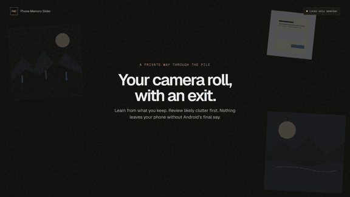

# Phone Memory Slider

[](https://github.com/Coflazo/phone-memory-slider/actions/workflows/ci.yml)

Your camera roll, with an exit.

[](brag-output/brag.mp4)

Phone Memory Slider is a local-only Android-to-desktop gallery cleanup beta. It learns from the photos you have marked as favorites, ranks the rest by how likely they are to be clutter, and lets you make the final call with a swipe. Photos and videos stay inside the local session, and Android owns the last recoverable-trash confirmation.

## What it does

- Pairs the Android companion and desktop app over authenticated local HTTPS.
- Reads only media the user has authorized through Android's media APIs.
- Builds a private preference model from favorites on the desktop.
- Ranks likely screenshots, duplicates, low-quality captures, and other cleanup candidates.
- Reviews photos and playing videos with swipe, keyboard, buttons, and undo.
- Shows the queued item count and reclaimable storage before anything moves.
- Hands the final batch to Android's recoverable system trash flow.

## Local means local

There is no account, cloud service, telemetry, remote inference, face identity, or permanent-delete fallback. Pairing uses a short-lived session code, TLS, and certificate pinning. The desktop cache is temporary. Favorites are protected during ranking, queue preparation, and a final phone-side recheck.

The transport and deletion details are documented in [the protocol](docs/protocol.md) and [privacy notes](docs/PRIVACY.md).

## Beta status

The Qt desktop release build and all five desktop/core test executables pass on Windows. The Android scaffold checks pass. The repository's CI builds the C++ core and Qt desktop on Windows, macOS, and Linux, and assembles the Android companion with SDK 36.

Before a release, the Android build and complete pairing-to-trash flow must still be accepted on real phone hardware. iPhone support is not included in this beta.

## Build the desktop app

Requirements: CMake 3.24+, a C++23 compiler, and Qt 6.8+ with Quick, Quick Controls 2, Network, SQL, Concurrent, and Multimedia.

```powershell
cmake -S . -B build -DPMS_BUILD_DESKTOP=ON
cmake --build build --config Release --parallel
ctest --test-dir build -C Release --output-on-failure
```

To create the Windows ZIP package:

```powershell
cpack --config build/CPackConfig.cmake -G ZIP
```

## Build the Android companion

Requirements: JDK 17, Android SDK 36 with accepted SDK licenses, and Gradle 8.13.

```powershell
gradle --project-dir android-companion testDebugUnitTest assembleDebug
```

Generated Gradle wrapper binaries are intentionally excluded. CI pins Gradle 8.13 and uploads the debug APK as a workflow artifact.

## Core-only verification

```powershell
cmake -S . -B build-core -DPMS_BUILD_DESKTOP=OFF
cmake --build build-core --config Release --parallel
ctest --test-dir build-core -C Release --output-on-failure
./build-core/tools/Release/pms_benchmark.exe
```

## Project links

- [Editable Figma design](https://www.figma.com/design/hVRuncNTA1D6rBb0zYT3CF)
- [User guide](docs/USER_GUIDE.md)
- [Design system](DESIGN.md)
- [Privacy model](docs/PRIVACY.md)
- [Local protocol](docs/protocol.md)
- [Release checklist](docs/RELEASE_CHECKLIST.md)
- [Full product demo](brag-output/brag.mp4)

Licensed under Apache-2.0. Geist font notices are in [THIRD_PARTY_NOTICES.md](THIRD_PARTY_NOTICES.md).
